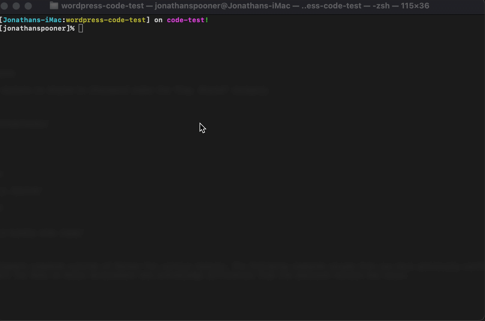

# WordPress Code Test

The Carrot Engineering team **appreciates you** and the time you are investing in our code challenge. For brevity, our project consists of a preconfigured WordPress development environment.

After finishing one or more of the following tasks, please submit a pull request with your finished work.

## Getting Started

Your first task is to get the development environment running and **debug an issue** that is preventing the theme from being loaded.

1. Install [Docker CE](https://docs.docker.com/v17.09/docker-for-mac/install/)
2. Run `docker compose up`

To verify WordPress is running correctly, ensure you have a 200 response code with a `Content-Length` header showing zero bytes.




## Tasks


💪 Congragulations for flexing your debugging skills and resolving the theme loading issue.  You can now login with the username of `carrot` and password `password`.

We have designed three tasks to test your knowledge of HTML/CSS, PHP, and Gutenberg.  Please select one or more tasks that best represent your skills. 

### Task #1 Design

Real Estate agents love ❤️ our fresh look on web design.
Work within the `twentytwentyone` theme to design a Real Estate landing page.

Since this is a "landing page," feel free to exclude the header and footer.  We will evaluate your work on the quality of your code, how it functions in the browser, and its visual aesthetics.

If you need inspiration, you can browse [dribbble.com](https://dribbble.com/search/real%20estate) for real estate designs.

### Task #2 Plugin Development

Develop a WordPress plugin that displays the [top ten trending audio tracks](https://audiusproject.github.io/api-docs/#trending-tracks) from [audius.co](https://audius.co) as a page or module in the sidebar.  You have the creative freedom to build something you see as excellent.

We will evaluate your work on the quality of your code, unit tests, and visual display of the trending audio tracks.

### Task #3 Gutenberg Development

Use your creativity to create a custom block that real estate agents would love.  If you need inspiration, you can browse [dribbble.com](https://dribbble.com/search/real%20estate) for real estate designs.

Create a custom Gutenberg block as a plugin or built it directly into the theme, your choice.

When completed, you will need to export the database and commit the SQL file.  This command will dump the DB and overwrite the `test_dump.sql` file.

```bash
docker exec wordpress-code-test_db_1 /usr/bin/mysqldump -u wordpress --password=wordpress --no-tablespaces wordpress > ./db/test_dump.sql
```

## License

Copyright © Carrot Inc., 2021
